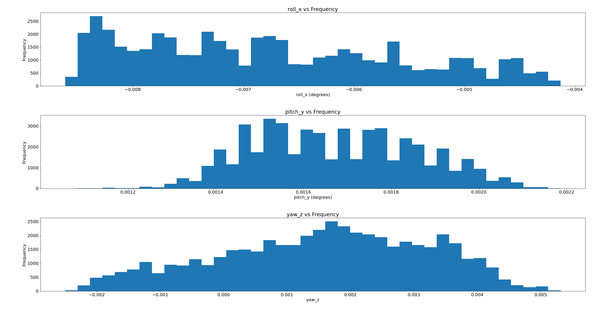
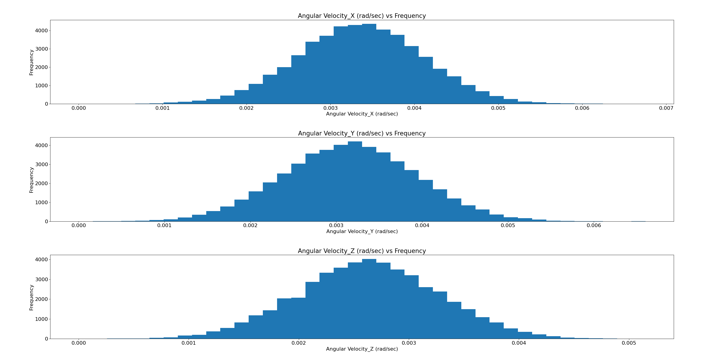
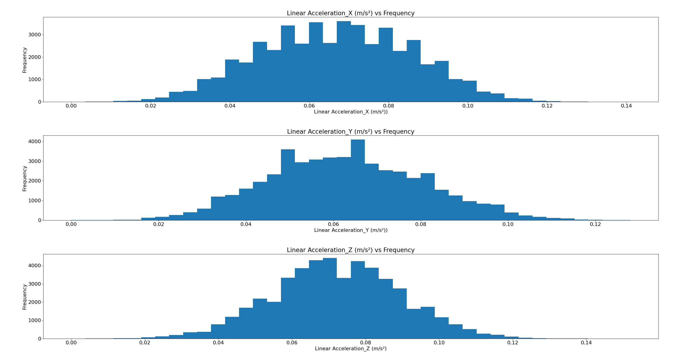
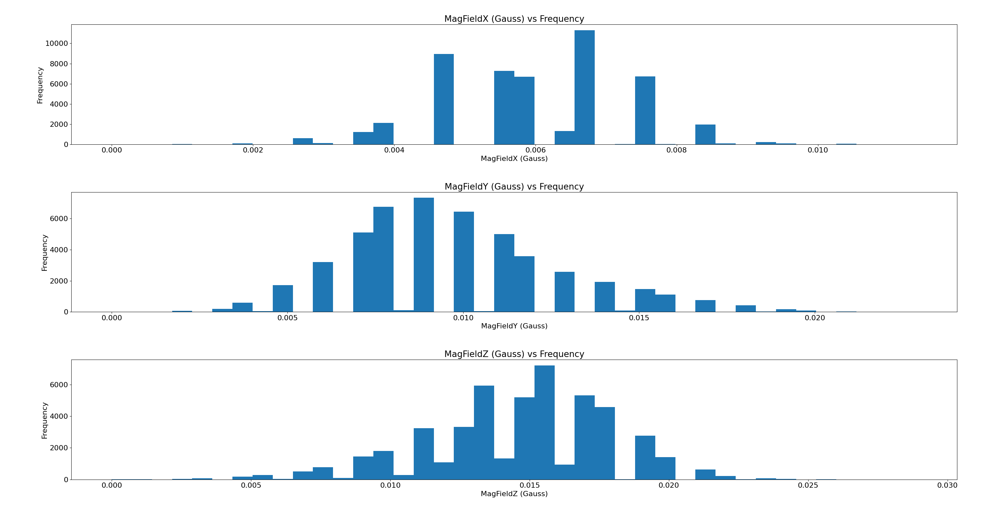
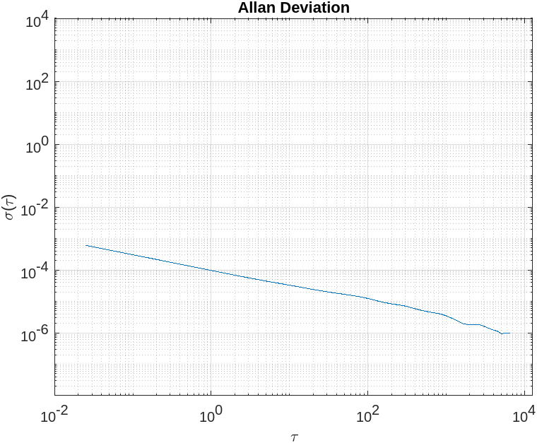
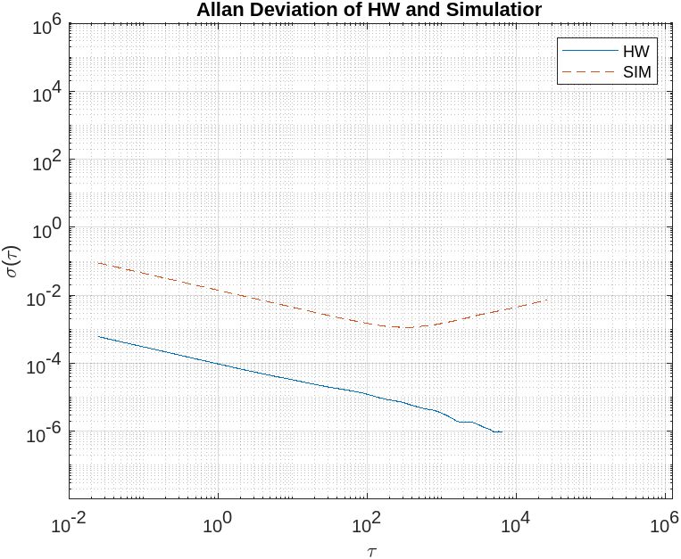
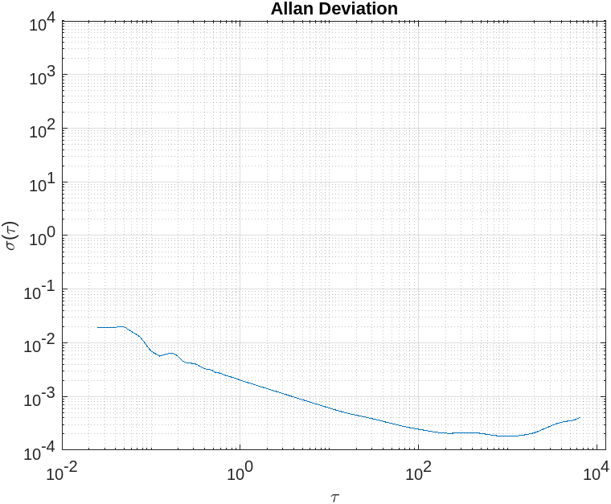
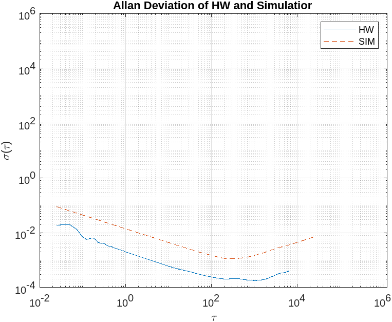

# Inertial Measurement Unit (IMU)
Inertial Measurement Unit (IMU) is a component of the Inertial Navigation System (INS), a navigation device used to calculate the position, velocity and orientation of a moving objectwithout external references.
Inertia is a word we use when we talk about matter and movement. Basically, our idea of inertiagoes back to Newton’s first two laws of physics:
1. An object at rest tends to stay at rest.
2. An object in motion tends to stay in motion.
Inertia is the quality in matter (matter is anything you can touch) that lets it stay still if it is still,or keeps it moving if it is moving. If we want to overcome inertia, we have to apply a force. A force will make something that is still start to move and will slow or stop something that is already moving.

# Inertial Sensors
Inertial sensor measures the acceleration and angular velocity of an object along three mutually perpendicular axes. IMUs measure these quantities based on the physical laws of motion (i.e., by indirectly mea-suring specific forces). Inertial sensors are composed of accelerometers and gyroscopes, which measure specific force and turn rate, respectively. The so-called inertial measurement unit contains three mutually orthogonal accelerometers and three mutually orthogonal gyroscopes.

# Accelerometer
Accelerometer measures and tells you the amount of force (acceleration) it is experiencing in X,Y and Z direction. Now, this data makes sense in orientation because of gravity. We know that if an object is not moving it will experience acceleration only due to gravity (neglect the other minimal forces). The direction of gravitational force is always same with respect to the earth’s frame but based on the orientation of IMU, it will experience different amount of acceleration along the three axes. These acceleration values can give us roll and pitch values.

# Gyroscope
Gyroscopes, however, measure both the displacement of the resonating mass and its frame. It measures the angular velocity along the three axes. So it is not directly able to predict roll,pitch or yaw. But as we can see integrating angular velocity over time gives us the angle, which can be used to measure the change in roll, pitch and yaw. Although this technique is not used that much as the readings of the gyroscope are very erroneous.

# Magnetometer
It is a device capable of measuring magnetism. It is able to help us find orientation using the earth’s magnetic field, similar to a compass. As in accelerometer one can use the X, Y and Z magnetometer readings to calculate yaw.

# Sources of Error
* **Inherent Sensor Noise (Random Walk)**
* **Linear Vibration**
* **Misalignment Errors**
* **Input Range**
* **Bias**
* **Scale Factor**
* **Timing Errors (Latency)**

# Orientation Plots

 
 

# Angular Velocity Plots




# Linear Acceleration Plots


 

# Magnetic Field Plots


 


# Allan Variance (Analysis Of 5-Hours Data)
An Allan Variance test is a method used for identifying the noise properties of an inertial sensor. A sensor is mounted statically inside a thermal chamber set to a constant temperature, with data logged at high rate for an extended period (typically several hours). The data is down-sampled at various time constants (averaged down to lower sampling rates), and the variances of each of these down-sampled measurements can be calculated at each of the
different time constants. Despite its name, most of the time the results are plotted as standard deviations (square root of variance) versus the down-sampled time constants a log-log scale.


For this part, We collected roughly 5 hours worth of stationary IMU data at a location that is not subject to vibrations (passing trains, building sway, jumping children, etc). The best place would be someplace underground / in a basement (wooden houses have a small vibration with the wind & this IMU has the tendency to detect even this small vibration so do not collect on wooden flooring/between wooden walls. No external factor should be present to really see the IMU’s natural behavior).
This is where the raw string in the imu_msg.msg may come in handy if say, the person recording finds a mistake in their driver later.

The following MathWorks webpage provides code that you can use to analyze your data for Allan-variance. We do not need any further analysis for Allan Variance other than that illustrated in this code.
-https://www.mathworks.com/help/nav/ug/inertial-sensor-noise-analysis-using-allan-variance.html

For the 5-hour long data rosbag file you can visit the following link:
-https://northeastern-my.sharepoint.com/:f:/r/personal/singh_risha_northeastern_edu/Documents/VectorNav-IMU%20ROSBAG%20file?csf=1&web=1&e=gK7dp2

The plots of Allan-Variance would appear like this:
# Angular Velocity Plots

  Allan Deviation of Angular Velocity           |  Allan Deviation of HW and Simulation of Angular Velocity             | 
:-------------------------:|:------------------------:|
|  |  | 

# Angular Velocity Plots

  Allan Deviation of Linear Acceleration           |  Allan Deviation of HW and Simulation of Linear Acceleration             | 
:-------------------------:|:------------------------:|
|  |  | 


The plot shown in above fig illustrates two key specifications for an inertial sensor:
* **The Angle Random Walk (equivalent to noise density)**
* **The in-run bias stability**

Noise density is roughly equal to the standard deviation at an averaging time constant of one second, while the minimum standard deviation value on the plot is the in-run bias stability. If we drop a perpendicular line from τ = 10 0 , the point at which it intersects the Allan Deviation Graph is the ”Angle Random Walk” and the point at which the slope of Allan Deviation Graph is zero is the ”in-run bias stability”.

# Follow the steps to perform experiment of parsing the $VNYMR message from VectorNav VN-100 IMU.
# 1.Hardware Setup
Imu udev rules Standard Ubuntu is not designed for robotic application and for fast sensors it may not behave as we want it to. There may be latency in terms of its response to the sensor. There are a set of files under /etc/udev that dictate how Ubuntu will react to certain sensors. To make the VN-100 plug & play and to address Ubuntu USB latency issues we can do the following:
1. Connect your IMU (ensure to add it in the list of USB devices if you are using VirtualBox) and type the following command in the terminal $ dmesg | tail -20. If you do not know what those commands mean, check out the Linux tutorial posted to Piazza.
2. You will see your sensor attributes including product id and vendor id. These will be listed in the most recent logs after dmesg once you plug the device in. If these values differ from the values below, change them in your 50-VN-100.rules file accordingly.
3. As sudo create a file under /etc/udev/rules.d called 50-VN-100.rules with the following:
```
KERNEL=="ttyUSB[0-9]*", ACTION=="add", ATTRS{idVendor}=="1d6b",
ATTRS{idProduct}=="0002", MODE="0666", GROUP="dialout"
```

4. Ubuntu's default latency of 16 ms cause issues with high-rate sensors, this can be solved by adding the
following UDEV rules as 49-USB-LATENCY.rules
```
ACTION=="add", SUBSYSTEM=="usb-serial", DRIVER=="ftdi_sio", ATTR{latency_timer}="1"
```
5. Once the rules have been added, to get udev to recognize the rule, run the following command:
```
sudo udevadm control --reload-rules && sudo service udev restart && sudo udevadm trigger
```
6. Finally unplug and replug the VN-100 to have it work with the new rules. You can verify the applied settings with the below command, should report 1 on success. (Verify it before you collect data each time, just to be safe)
```
$ cat /sys/bus/usb-serial/devices/<ttyUSB0 or your device path>/latency_timer
```
# Write a device driver for IMU, data collection & stationary noise analysis

1. Open serial port with 115200 baud rate. Configure your IMU to output data at 40Hz for this lab.
2. Parse $VNYMR string, to get accel, gyro, orientation (roll, pitch, yaw) and magnetometer data. Refer to sensor user manual for the string contents. Do not use pynmea library, it has very bad checksum handling problems.
3. Use the standard ROS sensor_msgs/IMU to publish the above data. Convert the above Yaw, Pitch, Roll data into quaternions and publish it as orientation in the same imu msg. Use ROS sensor_msgs/MagneticField to publish magnetometer data.

You need to code the Euler to quaternion conversions by yourself, do not use libraries. Your custom msg file called “imu_msg.msg” needs to contain the following message variables.
* **ROS Header with the name of Header ( The frame_id will be “IMU1_Frame”. You may usethe system time for the Header time stamp but keep the highest precision by using both the secs and nsecs)**
* **ROS sensor_msgs/IMU with the name IMU**
* **ROS sensor_msgs/MagneticField with the name MagField**
* **(optional) A string with any name containing the raw IMU string (this can help if you do not have the IMU and find a mistake in your driver after data collection)**

4. Begin collecting a time series data (rosbag) for the 3 accelerometers, 3 angular rate gyros, 3- axis magnetometers & the quaternions. Collect at least 10-15 min of data with the instrument stationary and as far away as possible from your computer.
5. Plot time series & frequency distribution of each axis of data in your report, and figure out the noise characteristics of each of the values (mean and standard deviation) reported by the IMU.

References:
- https://piazza.com/class_profile/get_resource/l6b4q8vovst62g/l8s4mq3aja44s4
- https://piazza.com/class_profile/get_resource/l6b4q8vovst62g/l8s4mrty6vp4x5
- https://www.mathworks.com/help/nav/ug/inertial-sensor-noise-analysis-using-allan-variance.html
- https://piazza.com/class_profile/get_resource/l6b4q8vovst62g/l8s4ms5crve4y5
- https://piazza.com/class_profile/get_resource/l6b4q8vovst62g/l8s4mxldtq55dj


