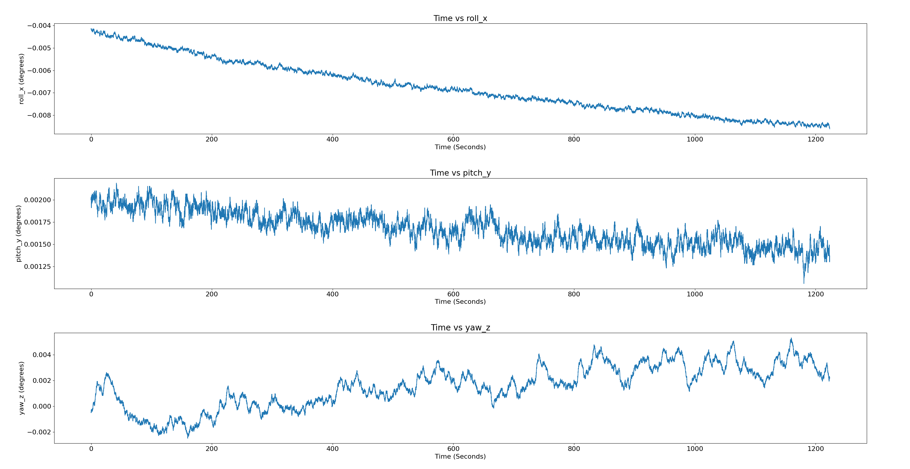
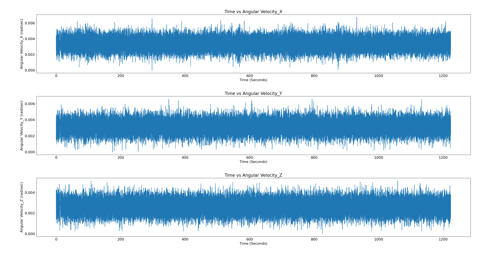
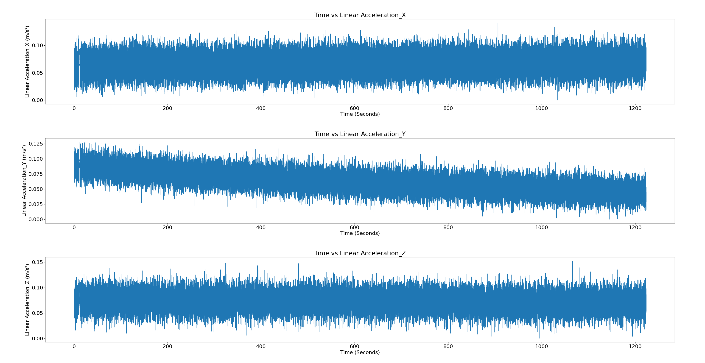
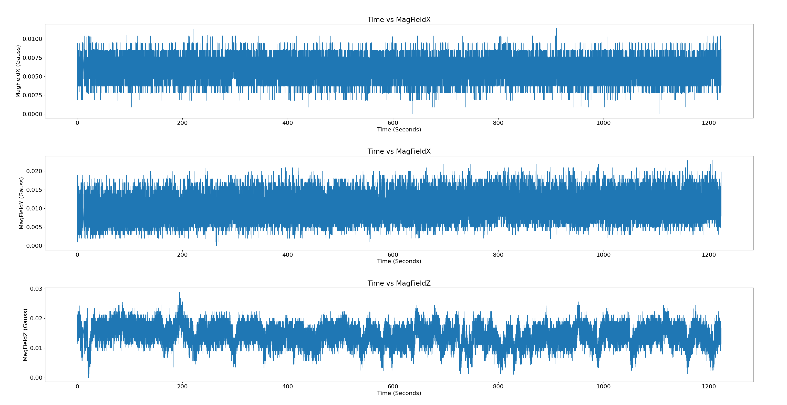

# Inertial Measurement Unit (IMU)
Inertial Measurement Unit (IMU) is a component of the Inertial Navigation System (INS), a navigation device used to calculate the position, velocity and orientation of a moving objectwithout external references.
Inertia is a word we use when we talk about matter and movement. Basically, our idea of inertiagoes back to Newton’s first two laws of physics:
1. An object at rest tends to stay at rest.
2. An object in motion tends to stay in motion.
Inertia is the quality in matter (matter is anything you can touch) that lets it stay still if it is still,or keeps it moving if it is moving. If we want to overcome inertia, we have to apply a force. A force will make something that is still start to move and will slow or stop something that is already moving.

# Inertial Sensors
Inertial sensor measures the acceleration and angular velocity of an object along three mutually perpendicular axes. IMUs measure these quantities based on the physical laws of motion (i.e., by indirectly mea-suring specific forces). Inertial sensors are composed of accelerometers and gyroscopes, which measure specific force and turn rate, respectively. The so-called inertial measurement unit contains three mutually orthogonal accelerometers and three mutually orthogonal gyroscopes.

# Accelerometer
Accelerometer measures and tells you the amount of force (acceleration) it is experiencing in X,Y and Z direction. Now, this data makes sense in orientation because of gravity. We know that if an object is not moving it will experience acceleration only due to gravity (neglect the other minimal forces). The direction of gravitational force is always same with respect to the earth’s frame but based on the orientation of IMU, it will experience different amount of acceleration along the three axes. These acceleration values can give us roll and pitch values.

# Gyroscope
Gyroscopes, however, measure both the displacement of the resonating mass and its frame. It measures the angular velocity along the three axes. So it is not directly able to predict roll,pitch or yaw. But as we can see integrating angular velocity over time gives us the angle, which can be used to measure the change in roll, pitch and yaw. Although this technique is not used that much as the readings of the gyroscope are very erroneous.

# Magnetometer
It is a device capable of measuring magnetism. It is able to help us find orientation using the earth’s magnetic field, similar to a compass. As in accelerometer one can use the X, Y and Z magnetometer readings to calculate yaw.

# Sources of Error
* **Inherent Sensor Noise (Random Walk)**
* **Linear Vibration**
* **Misalignment Errors**
* **Input Range**
* **Bias**
* **Scale Factor**
* **Timing Errors (Latency)**

# Orientation Plots

:-------------------------:|:------------------------:|
|  | 
|  | 

# Angular Velocity Plots

:-------------------------:|:------------------------:|
|  | 
|  | 

# Linear Acceleration Plots

:-------------------------:|:------------------------:|
|  | 
|  | 

# Magnetic Field Plots

:-------------------------:|:------------------------:|
|  | 
|  | 

